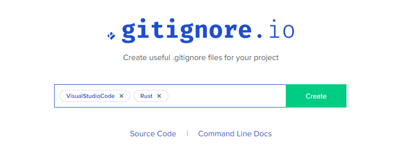
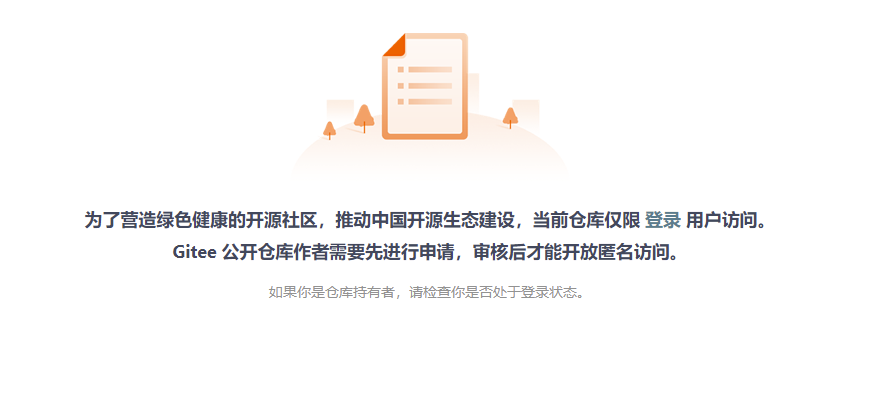

# 好耶,我接到一个新项目

## 使用 Git 管理你的源码

不管基于什么原因, 你最终选择了使用 **Git** 作为你的源码管理工具.在开始编码之前你使用 `git init` 命令初始化一个了本地仓库, 并且在这个仓库当中编写你的代码.

考虑到将来可能会产生一些不需要被托管的文件你决定在写 *README.MD* 之前首先编写一个名为 *.gitignore*, 让 **Git** 忽略那些如日志文件, 可执行文件, 临时文件等不需要被托管的文件. 但是自己一条一条写太慢, 所以你使用 [gitignore.io](https://www.toptal.com/developers/gitignore) 快速生成一个模板, 自己只需要添加特殊模板中没有的文件和目录即可.

<div align=center> </div>
> 你只需要输入你使用的编程语言和IDE即可自动生成一个 .gitignore 模板.

> 对于如同设置邮箱, 用户名等 **Git** 环境的设置请在安装 **Git** 的时候自行解决, 如需帮助可参考 [Git 安装配置](../00-安装配置&基础概念.md).

## 添加代码到托管

对仓库初始化并设置完成之后, 你并没有着急开始编码, 而是先创建了一个 `README.MD` 文件, 在里面编写关于这个程序的简单说明. 当你编写完成后通过 `git add README.MD` 将 `README.MD` 添加到暂存区, 但是你觉得没必要为了一个 README 单独做一次提交, 所以你接下来开始编写代码.

很快, 你完成了一个小的功能. 你先将代码添加到暂存区, 可是文件有好几个, 你不想要一个一个的添加, 也不想命令写很长, 所以通过 `git add .` 将所有被修改过的文件添加到暂存区, 然后通过 `git commit -m "初始化功能模块"` 将代码提交到本地仓库并准备开发下一个功能.

你的编码能力很强, 很快完成第二个功能模块. 你将修改过的文件全部添加到暂存区后然后通过 `git status` 查看提交状态, 并且发现暂存区中有一个名为 `fuck_you.rs` 的文件. 你认为内中的存在潜在的 BUG, 希望解决之后再提交, 虽然可以通过 `git reset` 将暂存区的所有文件移除, 但是你只需要移除 `fuck_you.rs` 所以你使用 `git reset fuck_you.rs` 单独移除了 `fuck_you.rs`.

## 提交到远程仓库

因为家里断网,所以你实际上是在网盘写了一天的代码.现在你要回家了,希望回家能接着写, 但是搞个U盘直接把代码拷贝回去显得太挫, 于是你在 `GitHub` 上创建了一个仓库作为远程仓库. 并通过 `git remote add origin git@github.com:lwifew/learn-git.git` 将本地仓库连接到刚建立的远程仓库, 并且给他起了一个别名叫做 `origin`. 小心谨慎的你除了觉得有必要查看一下是否连接成功共, 于是使用命令 `git remote -v` 查看已经连接的远程仓库地址.

```bash
$ git remote -v
origin  git@github.com:lwifew/git-test.git (fetch)
origin  git@github.com:lwifew/git-test.git (push)
```

## 修改分支名称

接下来该推送代码了, 可是你突然发现 `GitHub` 创建的仓库默认分支名称叫做 `main`, 而 Git 在本地创建的默认分支叫做 `master`, 为了保持统一, 你决定在上传之前通过 `git branch -m master main` 让他们保持统一. 接下来你便可以通过 `git push origin main:main` 将本地 `main` 分支提交到远程 `origin` 仓库的 `main` 分支.虽然 `git push origin master:main` 也是可以的,但是你希望以后能够直接使用 `git push` 所以还是修改了分支名称.

## 免密提交

使用 GitHub 托管代码确实很方便, 但是每次 push 都要输入免密让你多少有些不耐. 于是你在 GitHub 上添加了本地 ssh-key 让自己的提交不再需要输入密码.

## 仓库克隆与分支创立

过了一段时间, 你遇到一个 BUG, 很久都没有解决, 你想让你朋友帮你解决一下, 于是你把项目地址发给你的朋友, 他通过 `git clone https://github.com/lwifew/git-test.git` 将你的代码克隆到本地, 并进行修复. 他为了帮你修复 BUG 同时又不会引入新的 BUG 所以使用 `git branch hotfix` 创建 hotfix 分支, `git checkout hotfix` 切换到 hotfix 分支. 你知道这这两条命令可以使用 `git checkout -b hotfix` 一次解决, 但是你并没有告诉他. 糟老头子, 坏得很!

你的朋友很厉害, BUG 很快被解决, 他将代码上传到远程仓库的 hotfix 分支, 你则通过 `git pull origin hotfix:hotfix` 将分支拉取到本地. 确认没有问题之后你在 main 分支上通过 `git merge hotfix` 将 hotfix 的代码合并到主线.

## 文件变化

可是你很好奇他是怎么解决的 BUG 于是你通过 `git log` 查看代码提交记录, 然后通过 `git show 33a4dcfd5ef536eb3d3df59659613989db291e1d` 查看具体某一条提交内容.

## 修改远程仓库地址

其实,在选择远程仓库的时候,处于对国产开源社区的支持,你选择了 Gitee 来托管自己的代码,而不是更好的 Gitee,你当然知道 Gitee 不如 GitHub 优秀,但是你相信 Gitee 会变得很好,只是需要一些时间成长.但是在 2022年05月18日你发现 Gitee 把你的仓库设置为私有的了.你对於那些企图染指开源社区的崽种都是零容忍,你决定放弃使用 Gitee 这种垃圾,不想玷污自己的代码,因为你不喜欢要贞洁牌坊的婊子.于是你决定把远程仓库地址修改到 GitHub 上.



```bash
git remote set-url origin https://github.com/lwifew/git-test.git
```

<!-- 保持良好的提交记录 时间久了, 你发现自己的提交记录非常凌乱, 可利用价值不高 -->

## 命令总结

```bash
git init
git add file_name_list
git add .
git reset file_name_list
git reset
git remote add repository_address
git remote -v
git branch -m old_name new_name
git push alias local_branch:remote_branch
git clone repository_address
git branch new_branch
git checkout branch
git checkout -b new_branch
git merge banch
git log
git show hash_code
```
